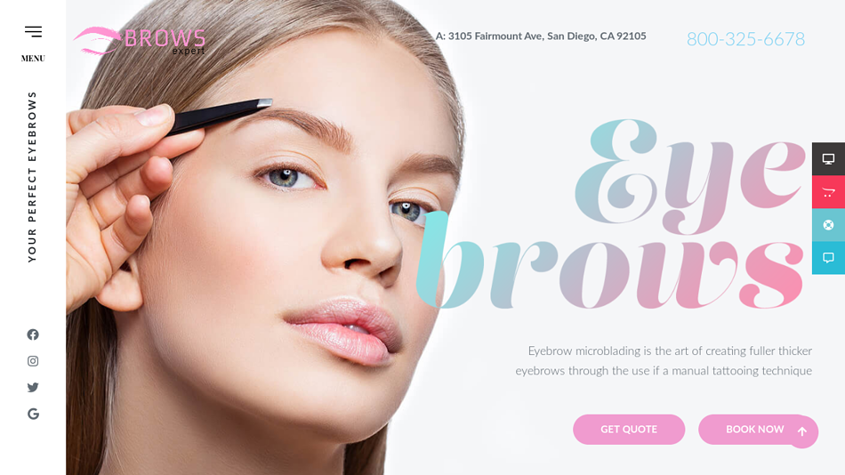

## Brows Expert
>this is readme page about brows expert website.
>> you can find lots of info about brows inside

>🔗 "Brows Expert" click here: <https://brows-expert.netlify.app/> 

>    

## Preview of Homepage

My favorite search engine is [Duck Duck Go](https://duckduckgo.com "The best search engine for privacy").

[`love`] & [`code`](#code)

>## Contributing
Pull requests are welcome. For major changes, please open an issue first to discuss what you would like to change.